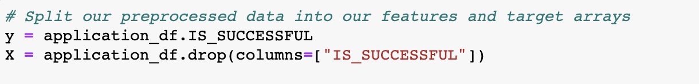
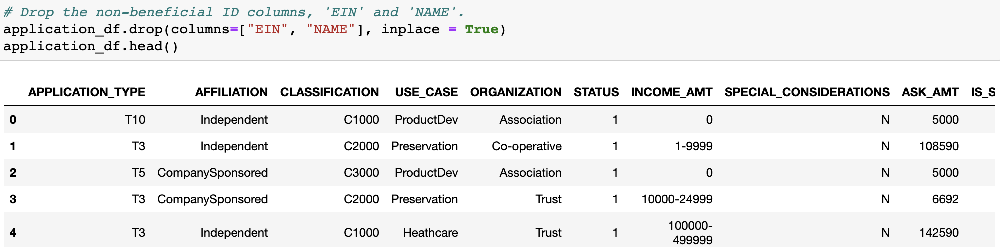
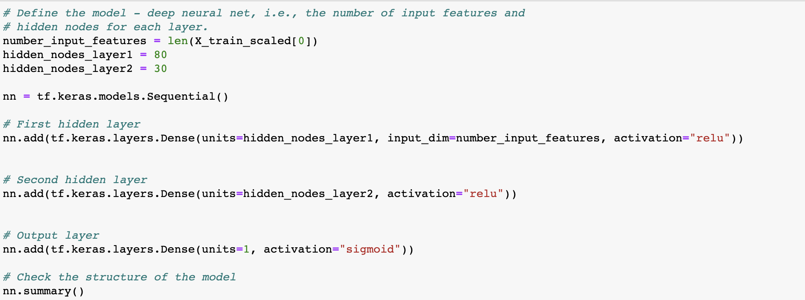
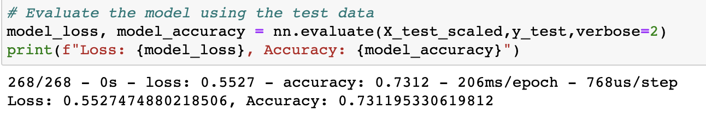
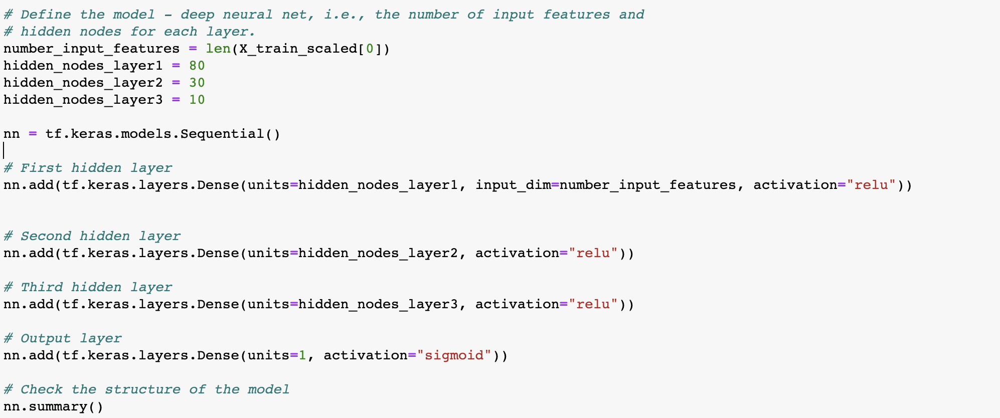
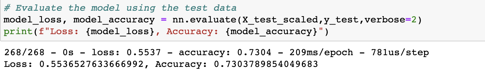
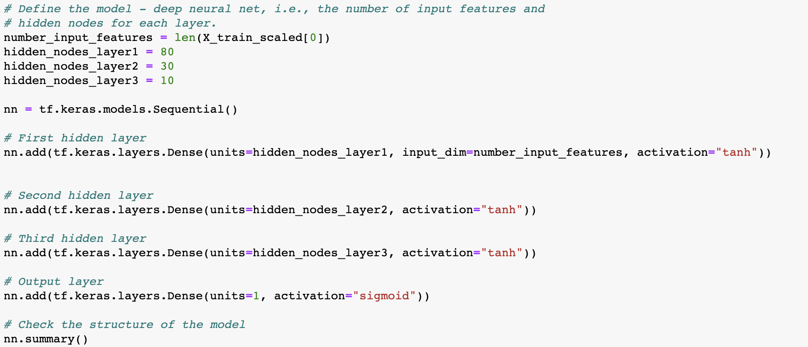
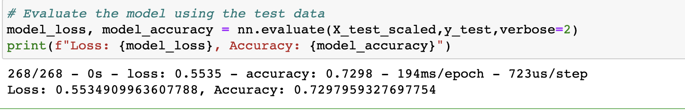
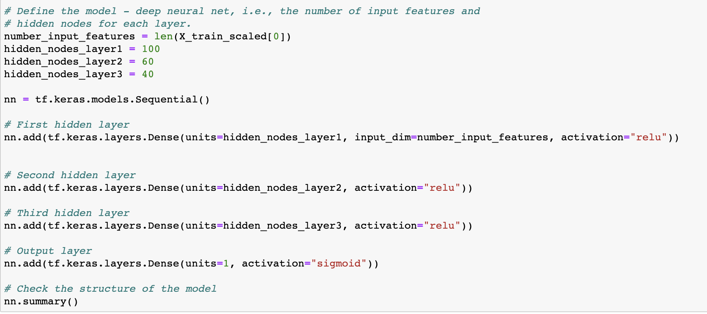
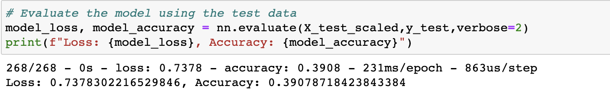

# Neural_Network_Charity_Analysis

## Overview 
The goal of this challenge and analysis is to determine whether applicants will be successful if funded by Alphabet Soup. From the business team, there is a CSV containing 34,000 organizations that had received funding from Alphabet Soup and whether or not the funds were used effectively. 

The CSV file has columns: 
- EIN and NAME—Identification columns
- APPLICATION_TYPE—Alphabet Soup application type
- AFFILIATION—Affiliated sector of industry
- CLASSIFICATION—Government organization classification
- USE_CASE—Use case for funding
- ORGANIZATION—Organization type
- STATUS—Active status
- INCOME_AMT—Income classification
- SPECIAL_CONSIDERATIONS—Special consideration for application
- ASK_AMT—Funding amount requested
- IS_SUCCESSFUL—Was the money used effectively

In this analysis, we pre-proccessed the data and then compiled trained and valuated a neural network model. The final step in the project was attempting to optimize the model to be accurate over 75% of the time. 

## Results

**Data Preprocessing**

- What variable(s) are considered the target(s) for your model?

The variable that we are trying to predict is the "IS_SUCCESSFUL" column - namely did the funded company use the money effectively?
- What variable(s) are considered to be the features for your model?

The variables considered to be features are all columns in the data frame besides the "IS_SUCCESSFUL" column.

Below see a screenshot of the data being split into a target and feature arrays:

- What variable(s) are neither targets nor features, and should be removed from the input data?

In our case, we removed EIN and NAME because they had little to no impact on the outcome of our analysis

Below see a screenshot of the variables that were removed:

**Compiling, Training, and Evaluating the Model**

- How many neurons, layers, and activation functions did you select for your neural network model, and why?

For the initial neural network model, there were 2 hidden layers. The first layer had 80 neurons and the second hadd 30. The hidden layers used the ReLu activation function and the output layer used the Sigmoid activation function.

- Were you able to achieve the target model performance?

The target model performance was 75% but in this attempt, the model performance was 73.12%.

- What steps did you take to try and increase model performance?

In order to improve performace, I tried 3 different tactics:

1. Added a third hidden layer but kept the activation function the same. 

This caused almost no change - the accuracy because 73.04%

2. I change the activation function in the hidden layers to be Tanh but left the output activation function as sigmoid.

This caused a slight decrease in accuracy to 72.98%

3. I upped the number of nodes in each hidden layer from 80 to 100, 30 to 60, and 10 to 40 to see if the model just needed to be trained more. 

This resulted in a huge accuracy loss to 39.08%

## Summary

The model ended up with the accuracy score of ~40% after 3 attempts to optimise the model. The initial neural network accuracy score was ~73%. One reason the model could have lost accuracy is that it was overfitted. 
One way to (hopefully) optimize the neural network could be by removing unneccesary features (such as "STATUS" and "SPECIAL_CONSIDERATIONS") or adding more data to the dataset. 
Another way to increase accuracy would be by switching modeld to using a Random Forest Classifier. Random Forest Classifiers are often strong and accurate models due to the estimators involved and the ability to not overfit the data. 